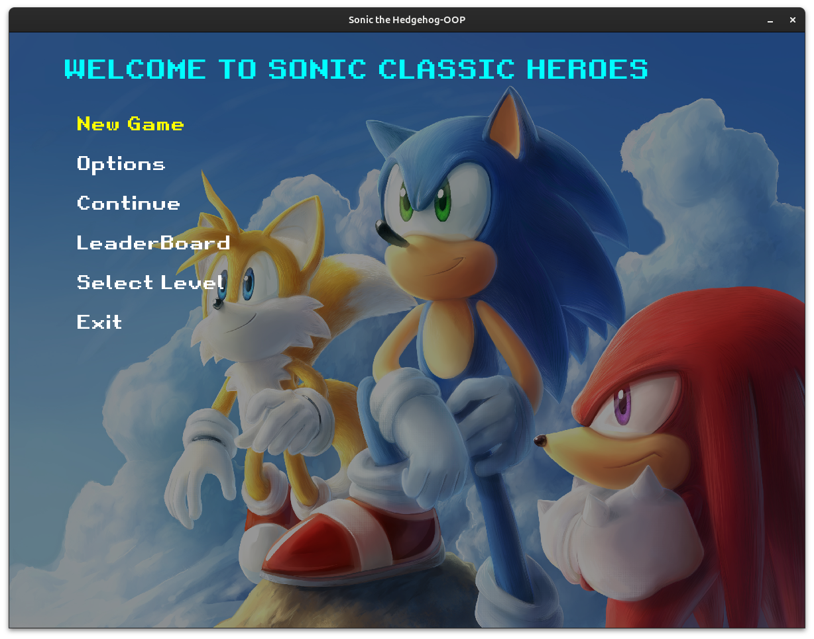
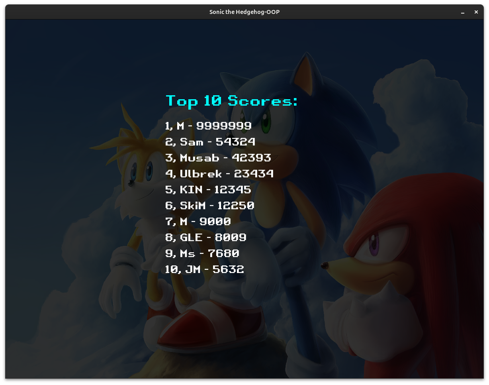
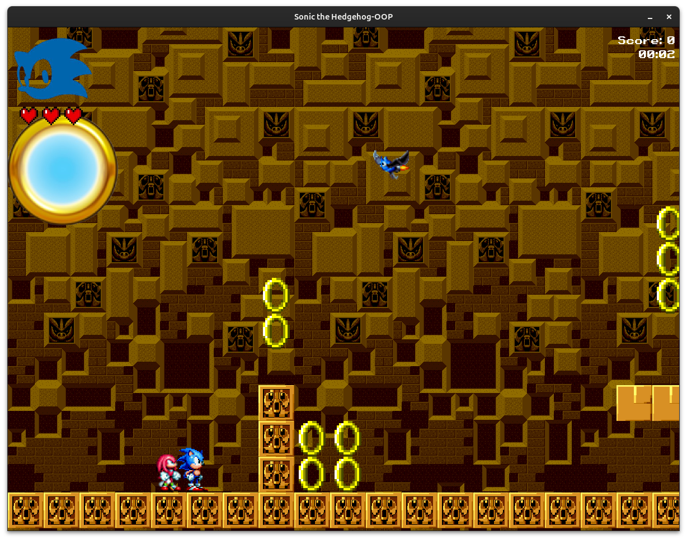
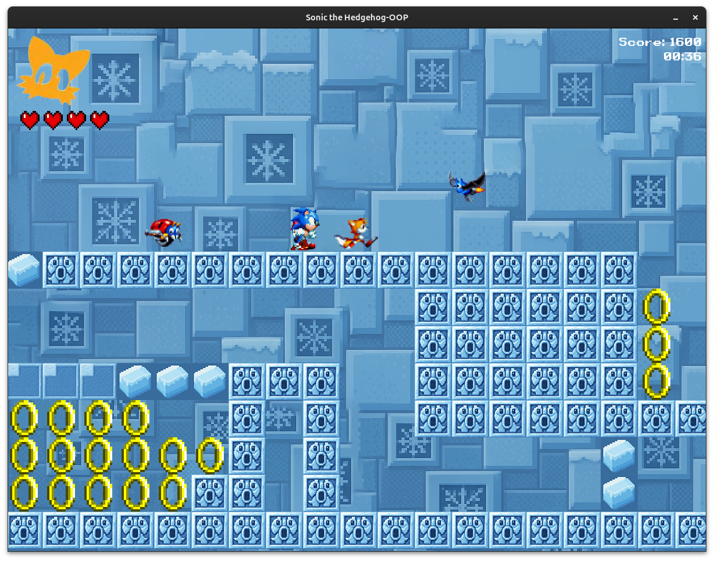
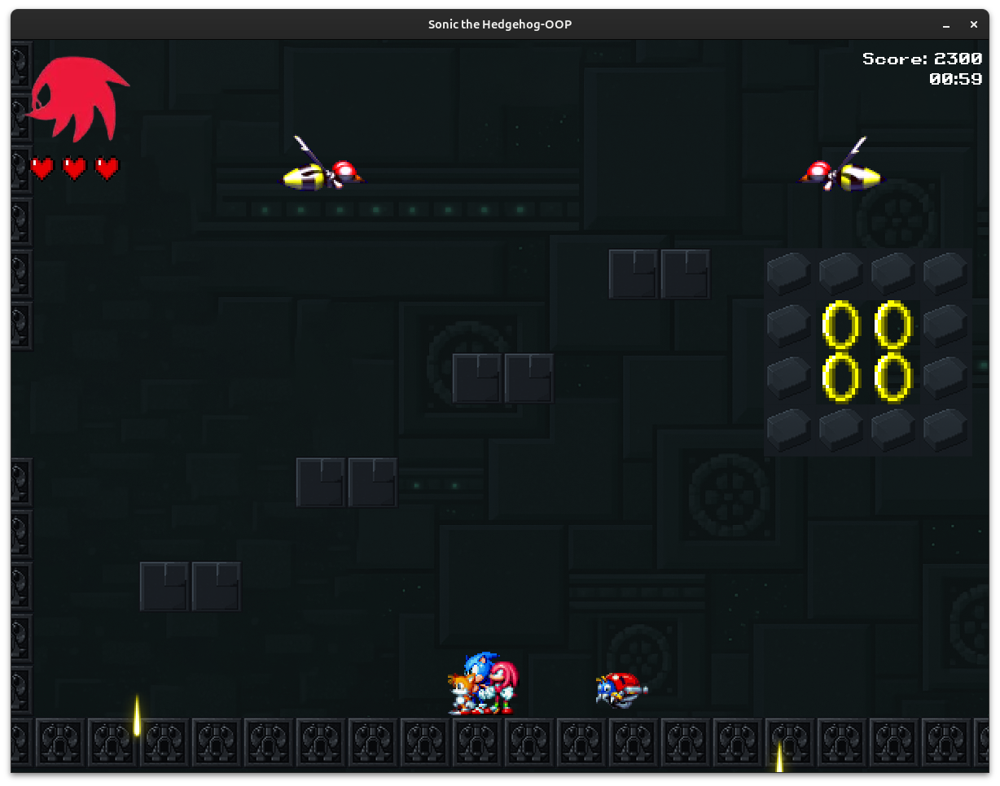
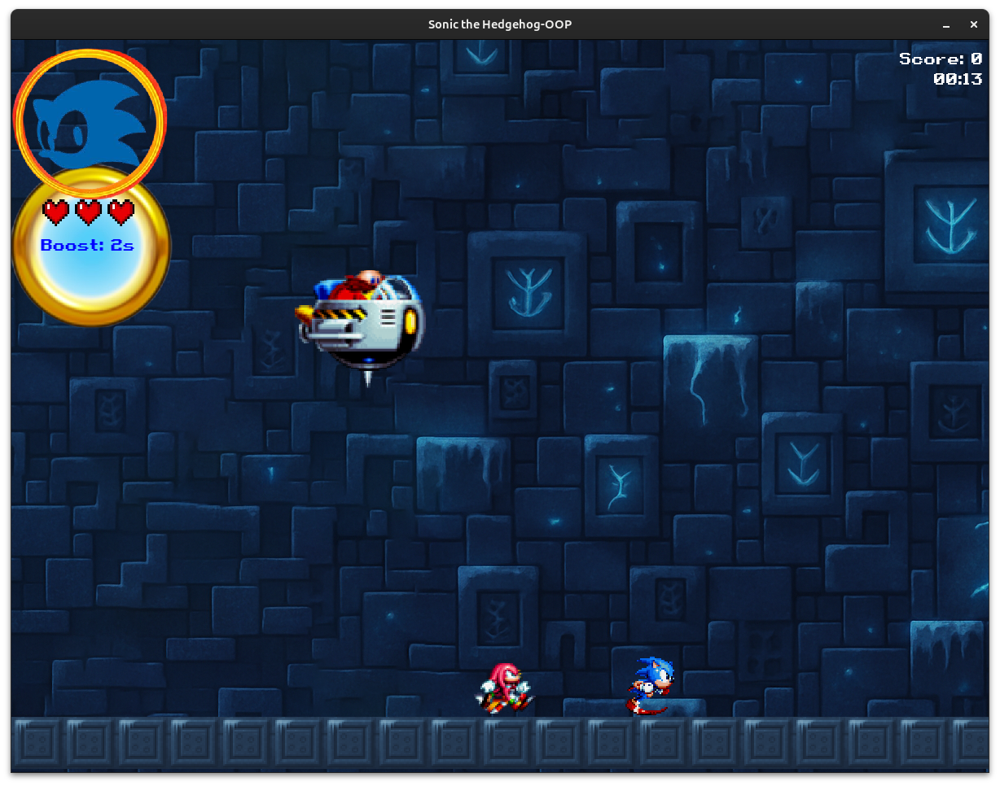

# 🎮 Sonic Classic Heroes — C++ OOP Remake

> **Semester Final Project**  
> A 2D remake of **Sonic Classic Heroes**, built in **C++** with **SFML**, demonstrating real Object-Oriented Programming principles like inheritance, polymorphism, abstraction, and composition.

---

## 🚀 Gameplay Overview

An original 2D platformer where you can:

- Play as **three different characters**
- Fight **four unique enemy types**
- Explore **three dynamic levels and a boss fight**
- Switch characters in real time
- Save progress and track your score

---

## 🧍‍♂️ Playable Characters

| Character | Ability |
|----------|---------|
| 🌀 **Sonic** | Fastest movement speed |
| 🦊 **Tails** | Can fly while carrying Sonic and Knuckles |
| 🦔 **Knuckles** | Can break walls and access hidden paths |

🎮 You can switch between them in real-time — each offers unique traversal mechanics.

---

## 👾 Enemy Types

| Enemy     | Behavior |
|-----------|----------|
| **Bee-Bot** | Flies in zig-zag and shoots projectiles every 5 seconds |
| **Crabmet** | Patrols horizontally and fires at intervals |
| **Motobug** | Crawls and chases the player aggressively |
| **Bat Brain** | Slowly flies toward the player |

---

## 🌍 Levels & Physics

| Level            | Features |
|------------------|----------|
| **Labyrinth Zone** | Standard gravity and friction |
| **Ice Cap Zone**   | Reduced friction for slippery movement |
| **Death Egg Zone** | Low gravity and low friction |
| **Boss Level**     | A flying boss that drops and crushes terrain every 10 seconds |

All levels are manually designed using custom tile maps and textures.

---

## 🛠️ Build & Run Instructions

### 📦 Requirements

- C++17 compatible compiler
- **CMake ≥ 3.10**
- **SFML ≥ 2.5**

### 🧱 Build Steps

```bash
# 1. Clone the repository
git clone https://github.com/Muntaz1r/OOP-Project-SonicClassicHeroes
cd OOP-Project-SonicClassicHeroes

# 2. Create a build directory
mkdir build
cd build

# 3. Generate project files
cmake ..

# 4. Build the executable
make

# 5. Run the game
./SonicClassicHeroes
```

---

## 🎮 Game Features

✅ Real-time character switching  
✅ Smart character following logic  
✅ Manual level design with collision  
✅ High score tracking  
✅ Save/load system  
✅ Custom boost & extra health pickups  
✅ Volume control and menu navigation  
✅ Manual sprite sheet extraction  
✅ No STL vectors — all logic is custom-implemented

---

## 🧠 Concepts Demonstrated

- Object-Oriented Programming (OOP)
  - Inheritance (Enemy types, Player types)
  - Abstract classes & interfaces (GameAssets, Level management)
  - Composition (Game → Menu, Scoreboard, Levels)
- Custom dynamic memory management
- SFML for game loop, rendering, input, and audio
- Modular game architecture with layered class directories

---

## 📸 Screenshots

### 🧭 Menu & Scoreboard

**Main Menu**  


**Leaderboard / High Scores**  


---

### 🌍 Levels

**Labyrinth Zone (Level 1)**  


**Ice Cap Zone (Level 2)**  


**Death Egg Zone (Level 3)**  


---

### 🧨 Boss Fight

**Final Boss — Egg Stinger Attack!**  


---

## 📁 Project Structure

```
├── classes/
│   ├── entities/
│   ├── game/
│   ├── factories/
│   └── ...
├── Src/              # Game entry point & main loop
├── Data/             # Textures, sounds, maps
├── assets/           # Screenshots
├── CMakeLists.txt
└── README.md
```

---

## 👨‍💻 Contributors

This was developed with Muhammad Saad as a **final project** for the Object-Oriented Programming.
